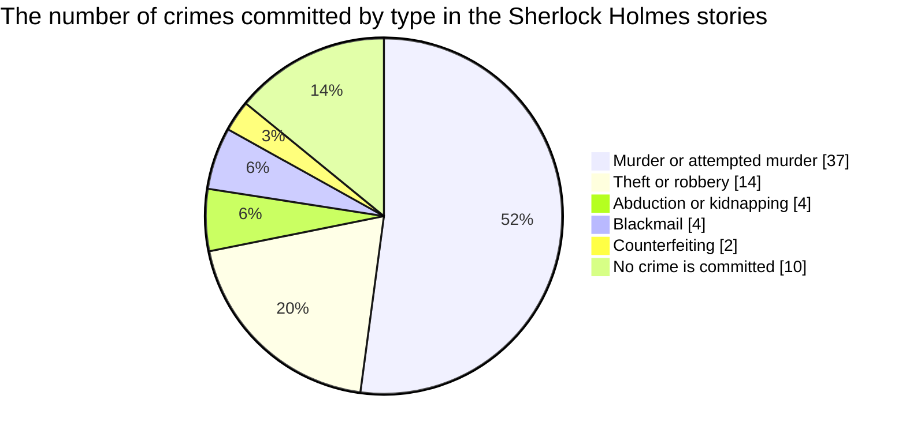
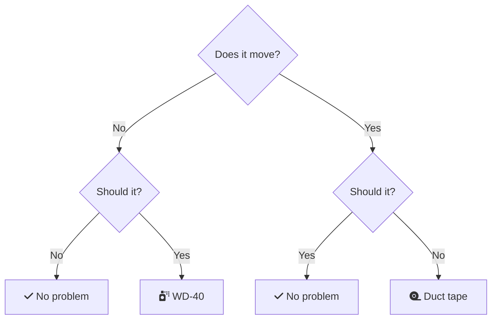

Using Mermaid Diagrams in Markdown
==================================

[Mermaid](https://mermaid-js.github.io/mermaid/) is a JavaScript-based diagramming and charting tool with a syntax inspired by Markdown. Mermaid can be used for creating diagrams of various types, e.g, pie chars, flowcharts, and UML class diagrams.

GitHub supports the use of Mermaid diagrams in Markdown documents, see, for example, [this](https://github.blog/2022-02-14-include-diagrams-markdown-files-mermaid/) blog post.

For [Pandoc](https://github.com/raghur/mermaid-filter), [mermaid-filter](https://github.com/raghur/mermaid-filter) provides Mermaid support.

Examples
--------

### Pie Chart

### Flowchart

Engineering flowchart:

### UML Class Diagram

TODO
